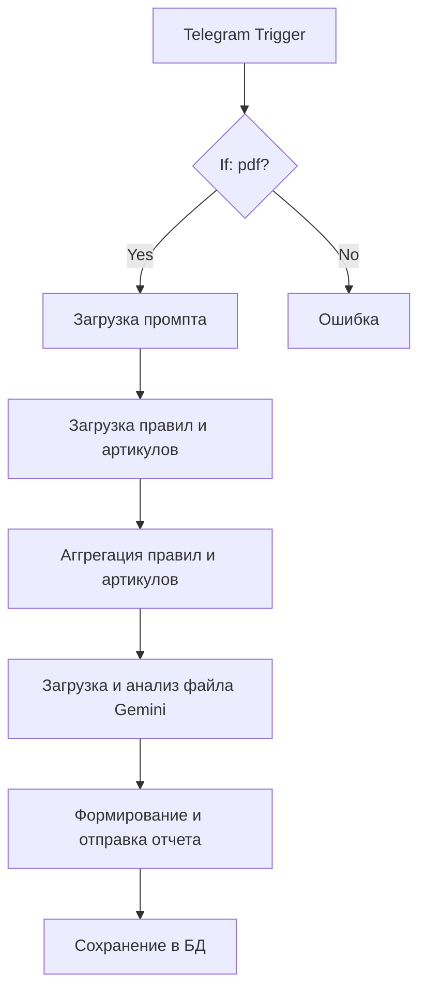

# Быстрая проверка заказов (первоначальное ТЗ)

> Ссылки на ресурсы
> Бот: https://t.me/testecooknabot
> Админ-панель: https://rules.entechai.ru (пользователь [test@test.ru](mailto:test@test.ru) пароль 123321)

### Цель автоматизации

Автоматизированная проверка PDF‑файлов с заказами на наличие:

* аномалий (нестандартная фурнитура, цвет, формула стеклопакета);
* нарушений правил (сверка с базой правил);
* технических ошибок (нулевые размеры, несуществующие артикулы, некорректное оформление).
  По итогам анализа бот формирует текстовый отчёт с перечнем найденных «красных флагов» и отправляет его пользователю в Telegram.

### Используемый стек

* **n8n** — платформа для интеграции и автоматизации процессов;
* **Linux/Docker** — среда исполнения;
* **PostgreSQL** — база данных для хранения правил, артикулов и истории проверок;
* **Telegram Bot API** — интерфейс для приёма файлов и отправки отчётов;
* **JavaScript** — для постобработки текста (экранирование MarkdownV2).

### Описание процесса

1. **Приём файла**Пользователь отправляет PDF‑файл через Telegram. Триггер фиксирует сообщение и проверяет MIME‑тип файла. Если тип не `application/pdf`, бот отвечает: *«Извините, я могу обрабатывать только файлы в формате pdf»*.
2. **Предварительные запросы к БД**
   * Из таблицы `qual_analize_prompts` загружается промпт для анализа.
   * Из таблицы `qual_analize_rules` выбираются активные правила проверки.
   * Из таблицы `art_rules` загружаются данные об артикулах и типах стекла.
3. **Загрузка и парсинг** Бот получает файл и извлекает текст с помощью стандартных средств n8n (`Extract from File`).
4. **Структурирование данных** JavaScript-код (Regex) разбирает текстовый поток на структурированные JSON-объекты (позиции заказа).
5. **Сохранение и Валидация** Данные сохраняются в PostgreSQL, где триггеры запускают процедуры проверки (`check_slip`, `size_control` и др.).
5. **Постобработка результата&#x20;**&#x4A;avaScript‑узел экранирует специальные символы MarkdownV2, чтобы отчёт корректно отображался в Telegram.
6. **Отправка отчёта&#x20;**&#x420;езультат анализа отправляется пользователю в чате.
7. **Сохранение в БД&#x20;**&#x412; таблицу `qual_analize_files` записываются:
   * имя файла;
   * текст отчёта;
   * username и chat\_id пользователя;
   * использованные правила;
   * использованный промпт.

### Схема процесса

### Ключевые особенности

* **Гибкость правил**: администраторы (сотрудники РКО Калева) могут добавлять новые правила через интерфейс администратора (Directus).
* **История проверок**: все отчёты сохраняются в БД с привязкой к пользователю и файлу.

### Администрирование

Администрирование правил, артикулов, таблицы слипания осуществляется в ПО Directus.
Реализован удобный табличный интерфейс, возможна настройка ролевой модели доступа.

**Вид таблицы с артикулами**

**Вид таблицы с результатами**

**Вид таблицы с правилами**
